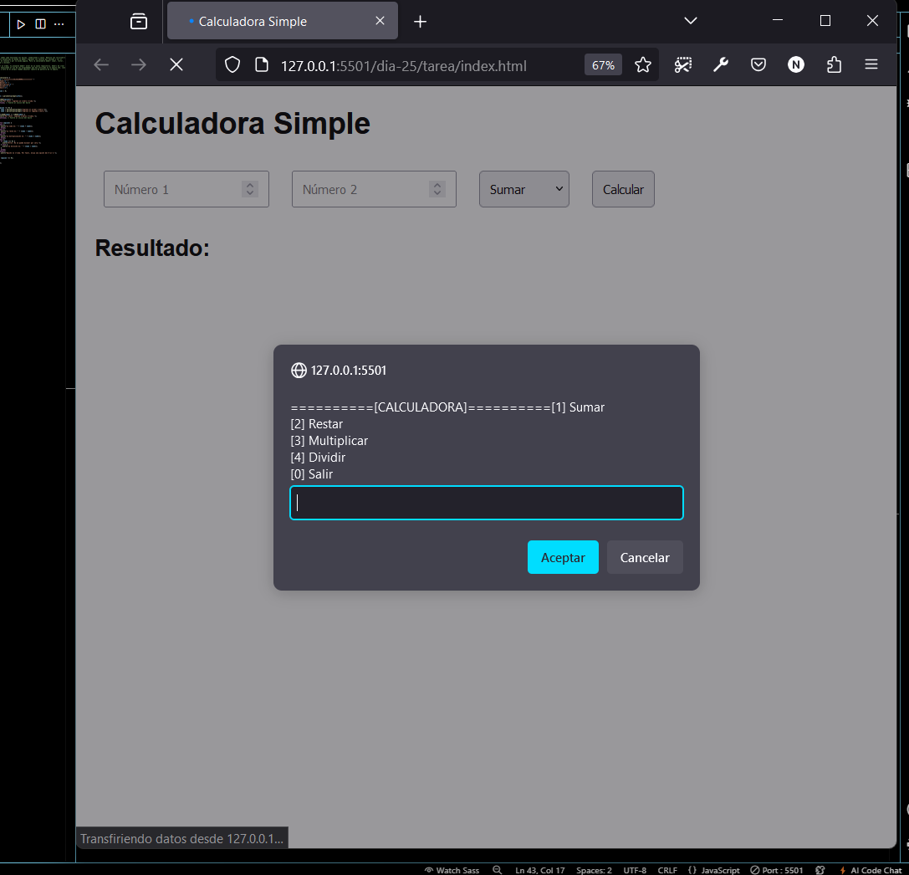

# Calculadora Simple en JavaScript

Esta es una calculadora simple que permite realizar operaciones de suma, resta, multiplicación y división usando JavaScript.

## Uso

1. **Ingresar Números**: Escribe dos números en los campos de entrada.
2. **Seleccionar Operación**: Escoge la operación que deseas realizar en el menú desplegable.
3. **Calcular**: Haz clic en el botón "Calcular" para ver el resultado.

## Propiedades Utilizadas

- **`addEventListener`**: Se utiliza para escuchar el evento de clic en el botón de calcular.
- **`parseFloat`**: Convierte las entradas de texto en números de punto flotante.
- **`switch`**: Permite realizar diferentes operaciones según la selección del usuario.
- **`textContent`**: Se utiliza para mostrar el resultado en la página.

## Captura de Pantalla

